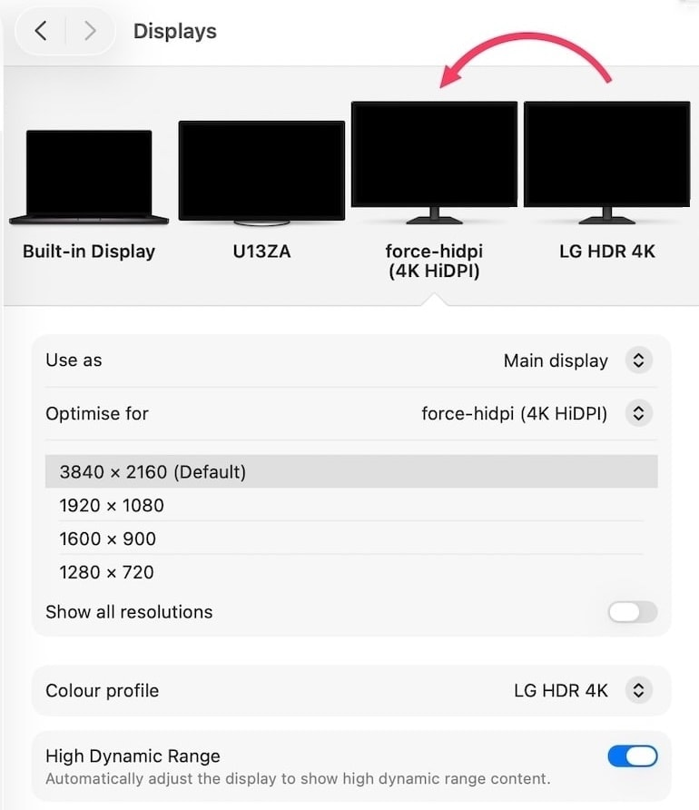

# force-hidpi

Workaround to force 3840x2160 HiDPI (scale 2.0) on 4K external displays connected to Apple Silicon M4/M5 Macs.

## The Problem

I've written a detailed blog post on the issue: [smcleod.net - New Apple Silicon M4 & M5 HiDPI Limitation on 4K External Displays](https://smcleod.net/2026/03/new-apple-silicon-m4-m5-hidpi-limitation-on-4k-external-displays/).

Apple Silicon M4/M5 DCP (Display Co-processor) firmware has a hardcoded pipe 0 width budget of 6720 pixels. HiDPI at 3840x2160 requires a 7680x4320 backing store, which exceeds this budget. The maximum HiDPI mode offered is 3360x1890.

This is a firmware regression from M1/M2/M3, where the same display gets 3840x2160 HiDPI without issue. See [Apple-Silicon_4k_Limitations.md](Apple-Silicon_4k_Limitations.md) for the full technical analysis including DCP firmware disassembly.



- [The Problem](#the-problem)
- [How It Works](#how-it-works)
  - [Quality features](#quality-features)
- [Requirements](#requirements)
- [Building](#building)
- [Usage](#usage)
  - [Running as a daemon](#running-as-a-daemon)
  - [Running at login](#running-at-login)
  - [All options](#all-options)
- [Limitations](#limitations)
- [How the DCP limitation works](#how-the-dcp-limitation-works)
  - [Optional supersampling](#optional-supersampling)
- [Tests](#tests)
- [Licence](#licence)

## How It Works

1. Creates a virtual display via SkyLight private API (`SLVirtualDisplay`) with a 7680x4320 pixel backing store and 3840x2160 point resolution (HiDPI scale 2.0)
2. Configures the physical 4K display as a **hardware mirror** of the virtual display using `CGConfigureDisplayMirrorOfDisplay`
3. The DCP's hardware scaler outputs the composited framebuffer at native 3840x2160

The hardware mirror path bypasses the `verify_downscaling` budget check that blocks direct 7680-wide backing stores on pipe 0. `system_profiler` confirms "Hardware Mirror: Yes" with the full resolution chain.

```
./force-hidpi
Target: (unknown) (0x1e6d:0x7750) 3840x2160 @ 60Hz
Virtual display created: 0x5e
  HDR mode: 16-bit compositing with PQ gamma correction
  Applied PQ-to-SDR gamma correction
  Quality for display 0x5e:
    BitsPerSample: 16
    BitsPerPixel:  64
    HDR enabled:   yes
    HDR supported: yes
  Quality for display 0x2:
    BitsPerSample: 10
    BitsPerPixel:  32
    HDR enabled:   no
    HDR supported: yes
  10-bit probe: virtual display compositing at 16-bit
  Already compositing at 16-bit
  Colour profiles already match

  Colour diagnostics:
    Virtual colour space:  ICC profile (3356 bytes)
    Physical colour space: ICC profile (3356 bytes)
    ICC profiles match:    YES
    Virtual size:  699 x 393 mm (3840x2160 px, 139.5 PPI)
    Physical size: 1393 x 789 mm (3840x2160 px, 70.0 PPI)
force-hidpi: active on (display) (3840x2160 HiDPI 16-bit via hardware mirror)
```

### Quality features

- **16-bit compositing** (default): The virtual display uses PQ (ST 2084) EOTF which gives 16-bit/64bpp compositing. A PQ-to-SDR gamma correction table is applied via `CGSetDisplayTransferByTable` so the output looks correct on SDR panels. Use `--no-hdr` for 8-bit compositing if preferred.
- **Colour profile matching**: The physical display's ICC profile is compared against the virtual display's profile. If they differ, the tool attempts to copy the physical profile to the virtual display via SkyLight/ColorSync APIs.
- **Consistent display identity**: The virtual display is created with the physical panel's vendor/product IDs and a fixed serial number, so macOS recognises it between sessions and preserves your display arrangement.
- **Hardware scaling**: The DCP's hardware scaler handles the downscale from the backing store to panel native, not software.

## Requirements

- Apple Silicon M4/M5 Mac,tested on M5 Max
- External 4K (3840x2160) display, tested on LG UltraFine 4K 32UN880
- macOS 26+, earlier versions may work but are untested

## Building

```bash
make
```

## Usage

```bash
# Activate HiDPI (auto-detects first 4K external display)
./force-hidpi

# Show display info and DCP pipe budgets
./force-hidpi --info

# Target a specific display by index
./force-hidpi --display 1

# Dry run (show what would happen)
./force-hidpi --dry-run

# 8-bit compositing instead of default 16-bit
./force-hidpi --no-hdr

# Stop with Ctrl+C, or if running as daemon:
./force-hidpi --stop
```

### Running as a daemon

```bash
./force-hidpi --daemon
./force-hidpi --stop
```

### Running at login

```bash
make install
```

This installs the binary (prompts for sudo), registers the LaunchAgent, and enables it at login. The agent restarts automatically if it exits abnormally but allows clean shutdown via `force-hidpi --stop`.

To remove:

```bash
make uninstall
```

### All options

```
  -i, --info         Show display diagnostics and exit
  -d, --display N    Target display index N (default: auto-detect)
  -s, --scale N      Pixel scale factor: 2, 3, or 4 (default: 2)
  -D, --daemon       Run as background daemon
  -S, --stop         Stop running daemon
  -n, --dry-run      Show what would happen without acting
      --no-hdr       Use 8-bit compositing instead of 16-bit
  -h, --help         Show help
  -V, --version      Show version
```

## Limitations

- The process must remain running (it owns the virtual display lifecycle)
- An extra "display" appears in System Settings and application display pickers
- Uses private SkyLight APIs which may break between macOS versions
- Text is sharper than without HiDPI but may not be identical to native HiDPI on M1/M2/M3 due to the extra compositing pass through the mirror path
- Doesn't have a GUI or other niceties - it's designed as a temporary workaround until Apple fixes the firmware regression, if you want some well designed and actively maintained software by for managing your displays in macOS you should check out [BetterDisplay](https://betterdisplay.pro)

## How the DCP limitation works

The M4/M5 DCP firmware contains a hardcoded constant `0x1A40` (6720) used as the external display pipe 0 width budget. The runtime check in `IOMFB::UPPipe::verify_downscaling()` compares the requested backing store width against `MaxVideoSrcDownscalingWidth` (6720 for external displays).

For comparison: the internal display gets `MaxVideoSrcDownscalingWidth = 10744`, and external sub-pipes 1-3 get 7680. The hardware supports the resolution; the limitation is a single firmware constant on pipe 0.

The hardware mirror path bypasses this check because mirrored displays receive pre-composited frames from the compositor rather than direct backing store swaps through `verify_downscaling`.

### Optional supersampling

The `--scale` flag controls the backing store multiplier (default: 2). Higher values render at a larger resolution and downsample via the hardware scaler:

- `--scale 2`: 7680x4320 backing (standard HiDPI)
- `--scale 3`: 11520x6480 backing (3x supersample)
- `--scale 4`: 15360x8640 backing (4x supersample, heavy GPU load)

The virtual display supports up to 4x pixels per point. In practice the visual difference above 2x is marginal.

## Tests

```bash
make test
```

## Licence

MIT
