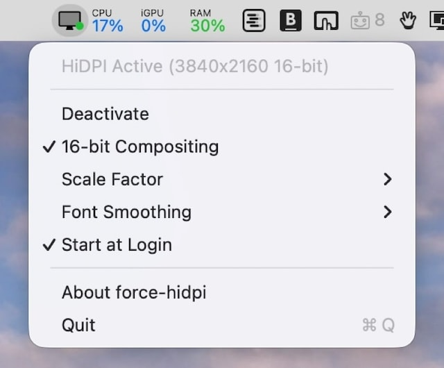

# Force HiDPI

macOS menu bar app that forces 3840x2160 HiDPI (scale 2.0) on 4K external displays connected to Apple Silicon M4/M5 Macs. This is a workaround - not the solution which lies with Apple fixing their external monitor support and buggy UI scaling.



## The Problem

Apple Silicon M4/M5 DCP firmware has a hardcoded pipe 0 width budget of 6720 pixels. HiDPI at 3840x2160 requires a 7680x4320 backing store, which exceeds this budget. The maximum HiDPI mode offered is 3360x1890.

This is a firmware regression from M1/M2/M3, where the same display gets 3840x2160 HiDPI without issue.

For the full technical analysis including DCP firmware disassembly, see the [blog post](https://smcleod.net/2026/03/new-apple-silicon-m4-m5-hidpi-limitation-on-4k-external-displays/).

## How It Works

1. Creates a virtual display via CoreGraphics private API (`CGVirtualDisplay`) at 3840x2160 points with a 7680x4320 pixel backing store (HiDPI scale 2.0)
2. Configures the physical 4K display as a **hardware mirror** of the virtual display
3. The DCP's hardware scaler outputs the composited framebuffer at native 3840x2160

The hardware mirror path bypasses the `verify_downscaling` budget check that blocks direct 7680-wide backing stores on pipe 0.

### Scale factor

The default 2x creates a 7680x4320 render buffer for the 3840x2160 logical resolution. Higher scale factors increase the render buffer further for super-sampled output with more screen real estate:

| Scale | Logical   | Render buffer | Notes                    |
| ----- | --------- | ------------- | ------------------------ |
| 2x    | 3840x2160 | 7680x4320     | Standard HiDPI (default) |
| 2.25x | 4320x2430 | 8640x4860     |                          |
| 2.5x  | 4800x2700 | 9600x5400     |                          |
| 3x    | 5760x3240 | 11520x6480    |                          |
| 3.5x  | 6720x3780 | 13440x7560    |                          |
| 4x    | 7680x4320 | 15360x8640    |                          |

### Quality features

- **16-bit compositing** (default): Uses PQ (ST 2084) EOTF for 16-bit/64bpp compositing with a PQ-to-SDR gamma correction table applied via `CGSetDisplayTransferByTable`. Toggleable from the menu bar.
- **Colour profile matching**: Compares ICC profiles between virtual and physical displays. If they differ, copies the physical display's profile to the virtual display via SkyLight API.
- **Consistent display identity**: Uses the physical panel's vendor/product IDs and a fixed serial number so macOS preserves display arrangement between sessions.
- **Hardware scaling**: The DCP's hardware scaler handles the downscale, not software.

## Requirements

- Apple Silicon M4/M5 Mac
- External 4K (3840x2160) display
- macOS 26+
- Swift 5.9+ toolchain

## Build & Install

```bash
make build        # release build
make install
```

Installs the binary to a user-writable directory on `PATH` if one exists (`~/.local/bin`, `~/bin`), otherwise falls back to `/usr/local/bin` (prompts for sudo). Registers a LaunchAgent and starts the app.

If a previous version is running, `make install` stops it and starts the new version automatically.

```bash
make uninstall    # stop and remove everything
make stop         # stop without uninstalling
make start        # start after a stop
```

You can also toggle "Start at Login" from the menu bar dropdown.

### Running debug build manually

```bash
make build-debug
.build/debug/ForceHiDPI
```

When run from a terminal, diagnostic output (quality info, ICC profiles, PPI) is printed to stdout.

## Limitations

- The process must remain running (it owns the virtual display lifecycle)
- An extra "display" appears in System Settings
- Uses CoreGraphics private API (`CGVirtualDisplay`) which could break between macOS versions, though this API is also used by DisplayLink and other hardware vendors
- Text is sharper than without HiDPI but may not be identical to native HiDPI on M1/M2/M3
- This is a workaround, not a fix. If you want well-designed, actively maintained display management software, check out [BetterDisplay](https://betterdisplay.pro)

## How the DCP limitation works

The M4/M5 DCP firmware contains a hardcoded constant `0x1A40` (6720) for the external display pipe 0 width budget. The runtime check in `IOMFB::UPPipe::verify_downscaling()` compares the backing store width against `MaxVideoSrcDownscalingWidth` (6720 for external displays).

The internal display gets `MaxVideoSrcDownscalingWidth = 10744`, and external sub-pipes 1-3 get 7680. The hardware supports the resolution; the limitation is a single firmware constant on pipe 0.

The hardware mirror path bypasses this check because mirrored displays receive pre-composited frames rather than direct backing store swaps through `verify_downscaling`.

## Licence

MIT
